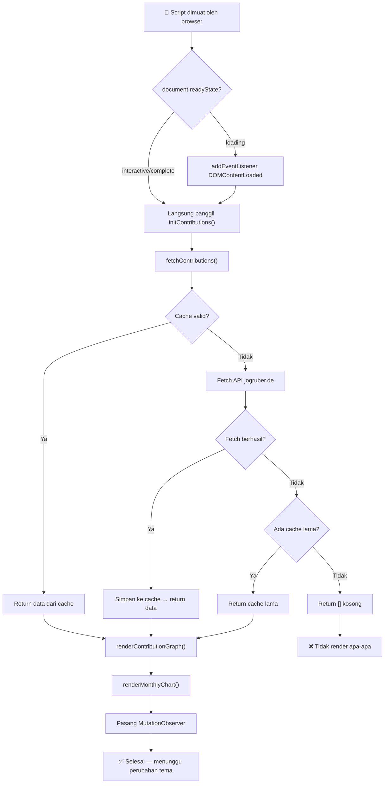

# 📊 Dokumentasi: `github-contributions.js`

Dokumentasi lengkap untuk modul **GitHub Contributions Heatmap & Monthly Bar Chart** yang digunakan pada portfolio website Adinda Kristiyani.

---

## Daftar Isi

- [Gambaran Umum](#gambaran-umum)
- [Sumber Data (API)](#sumber-data-api)
- [Struktur File](#struktur-file)
- [Konstanta & Konfigurasi](#konstanta--konfigurasi)
- [Fungsi-Fungsi](#fungsi-fungsi)
  - [getContribColor()](#1-getcontribcolorlevel-isdark)
  - [getMonthLabel()](#2-getmonthlabeldatestr)
  - [fetchContributions()](#3-fetchcontributions)
  - [getLastNMonths()](#4-getlastnmonthscontributions-months)
  - [buildHeatmapGrid()](#5-buildheatmapgridcontributions)
  - [renderContributionGraph()](#6-rendercontributiongraphcontributions)
  - [renderMonthlyChart()](#7-rendermonthlychartcontributions)
  - [initContributions()](#8-initcontributions)
- [Elemen HTML yang Dibutuhkan](#elemen-html-yang-dibutuhkan)
- [CSS Classes yang Dihasilkan](#css-classes-yang-dihasilkan)
- [Mekanisme Caching](#mekanisme-caching)
- [Dukungan Dark/Light Theme](#dukungan-darklight-theme)
- [Alur Eksekusi](#alur-eksekusi)
- [Keterbatasan & Catatan](#keterbatasan--catatan)

---

## Gambaran Umum

File `github-contributions.js` bertanggung jawab untuk:

1. **Mengambil data kontribusi GitHub** dari API pihak ketiga (tanpa token/autentikasi)
2. **Merender heatmap contribution graph** — visualisasi grid kotak-kotak berwarna seperti di profil GitHub (6 bulan terakhir)
3. **Merender monthly bar chart** — grafik batang total kontribusi per bulan (12 bulan terakhir)
4. **Menyimpan cache** ke `localStorage` untuk menghindari request berlebihan
5. **Auto re-render** saat tema (dark/light) berubah

---

## Sumber Data (API)

| Properti      | Detail |
|---------------|--------|
| **Provider**  | [github-contributions-api.jogruber.de](https://github-contributions-api.jogruber.de) |
| **Endpoint**  | `https://github-contributions-api.jogruber.de/v4/{username}?y=last` |
| **Auth**      | Tidak diperlukan (public, no token) |
| **CORS**      | ✅ Enabled — bisa dipanggil langsung dari browser |
| **Rate Limit**| Tidak didokumentasikan secara resmi, tapi disarankan caching |

### Format Response API

```json
{
  "total": {
    "lastYear": 93
  },
  "contributions": [
    {
      "date": "2025-07-13",
      "count": 0,
      "level": 0
    },
    {
      "date": "2025-07-14",
      "count": 3,
      "level": 1
    },
    {
      "date": "2026-02-15",
      "count": 12,
      "level": 3
    }
  ]
}
```

**Penjelasan field `contributions[]`:**

| Field   | Tipe     | Deskripsi |
|---------|----------|-----------|
| `date`  | `string` | Tanggal dalam format `"YYYY-MM-DD"` |
| `count` | `number` | Jumlah kontribusi pada hari tersebut |
| `level` | `number` | Intensitas warna (0–4), sama seperti warna kotak di profil GitHub |

> [!NOTE]
> `level` dihitung oleh API berdasarkan quartile distribusi kontribusi user.
> - `0` = tidak ada kontribusi
> - `1` = rendah
> - `2` = sedang-rendah
> - `3` = sedang-tinggi
> - `4` = tinggi

---

## Struktur File

```
assets/js/github-contributions.js
│
├── Konstanta & Konfigurasi        (baris 7-9)
│   ├── CONTRIB_USERNAME
│   ├── CONTRIB_CACHE_KEY
│   └── CONTRIB_CACHE_DURATION
│
├── Helper Functions
│   ├── getContribColor()          (baris 12-33)
│   ├── getMonthLabel()            (baris 35-39)
│   ├── getLastNMonths()           (baris 80-84)
│   └── buildHeatmapGrid()        (baris 86-127)
│
├── Data Fetching
│   └── fetchContributions()       (baris 41-78)
│
├── Rendering Functions
│   ├── renderContributionGraph()  (baris 129-202)
│   └── renderMonthlyChart()       (baris 205-264)
│
└── Initialization
    └── initContributions()        (baris 267-282)
```

---

## Konstanta & Konfigurasi

```javascript
const CONTRIB_USERNAME = "itskristyy";
const CONTRIB_CACHE_KEY = "github_contributions_cache";
const CONTRIB_CACHE_DURATION = 60 * 60 * 1000; // 1 jam (3.600.000 ms)
```

| Konstanta              | Tipe     | Default                          | Deskripsi |
|------------------------|----------|----------------------------------|-----------|
| `CONTRIB_USERNAME`     | `string` | `"itskristyy"`                   | Username GitHub yang datanya diambil |
| `CONTRIB_CACHE_KEY`    | `string` | `"github_contributions_cache"`   | Key localStorage untuk menyimpan cache |
| `CONTRIB_CACHE_DURATION` | `number` | `3600000` (1 jam)              | Durasi cache berlaku (dalam milidetik) |

> [!TIP]
> Untuk mengganti username, cukup ubah nilai `CONTRIB_USERNAME`. Tidak perlu mengubah kode lain.

---

## Fungsi-Fungsi

### 1. `getContribColor(level, isDark)`

Mengembalikan warna CSS (rgba string) berdasarkan level kontribusi dan tema aktif.

**Parameter:**

| Param    | Tipe      | Deskripsi |
|----------|-----------|-----------|
| `level`  | `number`  | Level intensitas kontribusi (0–4) |
| `isDark` | `boolean` | `true` jika tema gelap aktif |

**Return:** `string` — Nilai warna CSS dalam format `rgba(...)`.

**Peta Warna:**

| Level | Light Theme               | Dark Theme                  | Keterangan |
|-------|---------------------------|-----------------------------|------------|
| 0     | `rgba(0,0,0,0.04)`       | `rgba(255,255,255,0.04)`    | Tidak ada kontribusi |
| 1     | `rgba(112,88,91,0.2)`    | `rgba(222,191,194,0.25)`    | Rendah |
| 2     | `rgba(112,88,91,0.4)`    | `rgba(222,191,194,0.45)`    | Sedang-rendah |
| 3     | `rgba(112,88,91,0.65)`   | `rgba(222,191,194,0.7)`     | Sedang-tinggi |
| 4     | `rgba(112,88,91,0.9)`    | `rgba(222,191,194,1)`       | Tinggi |

> [!NOTE]
> Warna dipilih berdasarkan design token portfolio:
> - **Light**: `rgb(112,88,91)` = `--color-primary` (#70585B)
> - **Dark**: `rgb(222,191,194)` = `--color-primary` dark mode (#DEBFC2)

---

### 2. `getMonthLabel(dateStr)`

Mengkonversi string tanggal menjadi label bulan 3 huruf.

**Parameter:**

| Param     | Tipe     | Deskripsi |
|-----------|----------|-----------|
| `dateStr` | `string` | Tanggal format `"YYYY-MM-DD"` |

**Return:** `string` — Label bulan singkat (contoh: `"Jan"`, `"Feb"`, `"Mar"`).

**Contoh:**
```javascript
getMonthLabel("2026-07-12"); // → "Jul"
getMonthLabel("2026-01-01"); // → "Jan"
```

---

### 3. `fetchContributions()`

**Async function** — Mengambil data kontribusi harian dari API, dengan mekanisme caching.

**Parameter:** Tidak ada.

**Return:** `Promise<Array<{date: string, count: number, level: number}>>` — Array data kontribusi harian.

**Alur Logika:**

```
1. Cek localStorage → ada cache?
   ├─ Ya → cache masih valid (< 1 jam)?
   │       ├─ Ya → return data dari cache (TIDAK fetch API)
   │       └─ Tidak → lanjut ke step 2
   └─ Tidak → lanjut ke step 2

2. Fetch dari API
   ├─ Berhasil → simpan ke cache, return data
   └─ Gagal
       ├─ Ada cache lama → return cache (meski expired)
       └─ Tidak ada cache → return [] (array kosong)
```

> [!IMPORTANT]
> Fungsi ini **tidak pernah throw error** ke caller. Semua error ditangkap internal dan di-log ke console. Caller selalu menerima array (bisa kosong).

---

### 4. `getLastNMonths(contributions, months)`

Memfilter data kontribusi untuk N bulan terakhir.

**Parameter:**

| Param           | Tipe     | Deskripsi |
|-----------------|----------|-----------|
| `contributions` | `Array`  | Array data kontribusi harian |
| `months`        | `number` | Jumlah bulan ke belakang |

**Return:** `Array` — Subset dari contributions yang berada dalam rentang N bulan terakhir.

**Contoh:**
```javascript
// Jika sekarang Juli 2026, months = 6:
// → hanya data dari Februari 2026 – Juli 2026 yang dikembalikan
getLastNMonths(allContribs, 6);
```

---

### 5. `buildHeatmapGrid(contributions)`

Mengorganisir data kontribusi harian menjadi struktur grid mingguan untuk rendering heatmap.

**Parameter:**

| Param           | Tipe    | Deskripsi |
|-----------------|---------|-----------|
| `contributions` | `Array` | Array data kontribusi harian (sudah difilter) |

**Return:**
```javascript
{
  weeks: Array<Array<entry|null>>,  // Array kolom mingguan (7 baris per kolom)
  monthLabels: Array<{weekIndex: number, label: string}>  // Label bulan + posisinya
}
```

**Penjelasan struktur grid:**

```
        Week 0    Week 1    Week 2    ...    Week N
Row 0   Sun       Sun       Sun              Sun        ← Minggu
Row 1   Mon       Mon       Mon              Mon        ← Senin
Row 2   Tue       Tue       Tue              Tue        ← Selasa
Row 3   Wed       Wed       Wed              Wed        ← Rabu
Row 4   Thu       Thu       Thu              Thu        ← Kamis
Row 5   Fri       Fri       Fri              Fri        ← Jumat
Row 6   Sat       Sat       Sat              Sat        ← Sabtu
```

- Setiap kolom = 1 minggu (7 hari)
- Minggu pertama di-pad dengan `null` jika tidak dimulai dari hari Minggu
- Minggu terakhir bisa memiliki < 7 entries

---

### 6. `renderContributionGraph(contributions)`

Merender heatmap contribution graph ke DOM. Menghasilkan 3 bagian: label bulan, grid kotak, dan legend.

**Parameter:**

| Param           | Tipe    | Deskripsi |
|-----------------|---------|-----------|
| `contributions` | `Array` | Array lengkap data kontribusi |

**Return:** `void`

**Target DOM:** `#contrib-graph` (container utama) dan `#contrib-count` (teks total).

**Apa yang di-render:**

1. **Teks total** — Contoh: *"93 contributions in the last 6 months"*
2. **Month labels** — Label bulan (Jan, Feb, ...) diposisikan di atas kolom minggu yang sesuai menggunakan CSS `position: absolute` dengan `left: X%`
3. **Heatmap grid** — CSS Grid dengan `grid-template-rows: repeat(7, 1fr)` dan `grid-auto-flow: column`
4. **Legend** — Bar "Less □□□□□ More" di pojok kanan bawah

**Fitur interaktif:**
- Setiap cell memiliki `title` attribute (tooltip) dengan format: *"3 contributions on 2026-07-12"*
- Hover effect: `transform: scale(1.6)` pada cell

---

### 7. `renderMonthlyChart(contributions)`

Merender bar chart vertikal total kontribusi per bulan (12 bulan terakhir).

**Parameter:**

| Param           | Tipe    | Deskripsi |
|-----------------|---------|-----------|
| `contributions` | `Array` | Array lengkap data kontribusi |

**Return:** `void`

**Target DOM:** `#monthly-chart`

**Alur:**

1. Generate 12 slot bulan terakhir (termasuk bulan berjalan)
2. Agregasi total kontribusi per bulan dari data harian
3. Hitung nilai tertinggi (`maxVal`) untuk normalisasi
4. Render setiap bulan sebagai kolom bar dengan:
   - **Value** — angka total di atas bar
   - **Bar** — tinggi proporsional terhadap `maxVal`, minimum 2%
   - **Label** — nama bulan singkat di bawah bar
5. Animasi: bar dimulai dari `height: 0%` lalu transisi ke tinggi sebenarnya via `requestAnimationFrame` ganda

**Expected output visual:**

```
  0    2    0    5    10   163  ...
  │    ██   │    ██   ███  █████
  │    ██   │    ██   ███  █████
  Aug  Sep  Oct  Nov  Dec  Jan  ...
```

---

### 8. `initContributions()`

**Async function** — Entry point utama. Mengatur fetch data dan render semua komponen.

**Parameter:** Tidak ada.

**Return:** `Promise<void>`

**Alur:**

```
1. Fetch data kontribusi (dengan cache)
2. Jika data kosong → return (tidak render apa-apa)
3. Render contribution graph (heatmap)
4. Render monthly chart (bar chart)
5. Pasang MutationObserver pada <html data-theme="...">
   → Re-render otomatis jika tema berubah
```

**Inisialisasi otomatis:**

```javascript
if (document.readyState === "loading") {
  document.addEventListener("DOMContentLoaded", initContributions);
} else {
  initContributions();
}
```

Script akan berjalan otomatis begitu DOM ready. Tidak perlu dipanggil manual.

---

## Elemen HTML yang Dibutuhkan

Script ini mengharapkan elemen-elemen berikut ada di halaman HTML:

```html
<!-- Container heatmap -->
<div class="contrib-section glass-card">
  <p class="contrib-count" id="contrib-count">Loading...</p>
  <div class="contrib-graph-wrapper">
    <div id="contrib-graph" class="contrib-graph-container"></div>
  </div>
</div>

<!-- Container monthly chart -->
<div class="monthly-section glass-card">
  <h3 class="monthly-title">Monthly Contributions</h3>
  <p class="monthly-subtitle">Commits over the last 12 months</p>
  <div id="monthly-chart" class="monthly-chart"></div>
</div>
```

| ID / Selector        | Elemen    | Fungsi |
|-----------------------|-----------|--------|
| `#contrib-count`      | `<p>`     | Menampilkan teks total kontribusi |
| `#contrib-graph`      | `<div>`   | Container utama heatmap (diisi oleh JS) |
| `#monthly-chart`      | `<div>`   | Container monthly bar chart (diisi oleh JS) |

> [!WARNING]
> Jika elemen dengan ID di atas tidak ditemukan, fungsi render terkait akan di-skip secara diam-diam (tidak error).

---

## CSS Classes yang Dihasilkan

Script ini membuat elemen DOM secara dinamis dengan class berikut. Pastikan CSS mendefinisikan style untuk semua class ini:

### Heatmap

| Class                  | Elemen   | Deskripsi |
|------------------------|----------|-----------|
| `.contrib-months`      | `<div>`  | Container label bulan (relative positioned) |
| `.contrib-month-label` | `<span>` | Label bulan individual (absolute positioned) |
| `.contrib-grid`        | `<div>`  | CSS Grid container untuk heatmap cells |
| `.contrib-cell`        | `<div>`  | Satu kotak kontribusi (1 hari) |
| `.contrib-cell--empty` | modifier | Cell kosong (padding minggu pertama/terakhir) |
| `.contrib-legend`      | `<div>`  | Container legend "Less □□□□□ More" |
| `.contrib-legend-text` | `<span>` | Teks "Less" / "More" |
| `.contrib-legend-box`  | `<div>`  | Kotak warna individual di legend |

### Monthly Chart

| Class                | Elemen   | Deskripsi |
|----------------------|----------|-----------|
| `.monthly-bar-col`   | `<div>`  | Satu kolom bulan (value + bar + label) |
| `.monthly-bar-value` | `<span>` | Angka total di atas bar |
| `.monthly-bar-track` | `<div>`  | Container track bar |
| `.monthly-bar-fill`  | `<div>`  | Bar yang terisi (tinggi animasi) |
| `.monthly-bar-label` | `<span>` | Label nama bulan di bawah bar |

---

## Mekanisme Caching

```
┌─────────────────────────────────────────────────────┐
│                   localStorage                       │
│                                                      │
│  Key: "github_contributions_cache"                   │
│  Value: {                                            │
│    "data": [ {date, count, level}, ... ],            │
│    "timestamp": 1752328800000                        │
│  }                                                   │
└─────────────────────────────────────────────────────┘
```

| Aspek               | Detail |
|----------------------|--------|
| **Storage**          | `localStorage` |
| **Key**              | `"github_contributions_cache"` |
| **Durasi**           | 1 jam (3.600.000 ms) |
| **Validasi**         | `Date.now() - timestamp < CONTRIB_CACHE_DURATION` |
| **Fallback**         | Jika fetch gagal, gunakan cache lama (meski expired) |
| **Clear manual**     | `localStorage.removeItem("github_contributions_cache")` |

### Kapan cache digunakan?

| Skenario | Aksi |
|----------|------|
| Cache ada & valid (< 1 jam) | Return cache, **tidak fetch API** |
| Cache ada tapi expired | Fetch API → berhasil → update cache |
| Cache ada, fetch gagal | Return cache lama (meski expired) |
| Tidak ada cache, fetch gagal | Return `[]` (array kosong) |
| Pertama kali (tidak ada cache) | Fetch API → simpan ke cache |

---

## Dukungan Dark/Light Theme

Script secara otomatis mendeteksi dan merespons perubahan tema.

### Deteksi tema aktif:
```javascript
const isDark = document.documentElement.getAttribute("data-theme") === "dark";
```

### Auto re-render via MutationObserver:
```javascript
const observer = new MutationObserver(() => {
  renderContributionGraph(contributions);
  renderMonthlyChart(contributions);
});
observer.observe(document.documentElement, {
  attributes: true,
  attributeFilter: ["data-theme"]
});
```

Ketika atribut `data-theme` pada elemen `<html>` berubah, kedua grafik otomatis di-render ulang dengan skema warna yang sesuai.

---

## Alur Eksekusi



---

## Keterbatasan & Catatan

> [!CAUTION]
> **Jangan expose GitHub Personal Access Token di file ini.** Script ini memang didesain TANPA token karena menggunakan API komunitas yang public.

### Keterbatasan API

| Keterbatasan | Detail |
|-------------|--------|
| **Repo private** | Data kontribusi HANYA dari repo **publik** |
| **Jenis kontribusi** | `count` mencakup commits, PR, issues, reviews — bukan hanya commit murni |
| **Akurasi** | Data di-scrape dari halaman profil GitHub, bukan dari API resmi |
| **Ketersediaan** | API komunitas, bisa down sewaktu-waktu (mitigasi: caching) |
| **Delay data** | Bisa ada delay beberapa jam dari kontribusi terbaru |

### Keterbatasan Script

| Keterbatasan | Detail |
|-------------|--------|
| **Timezone** | Menggunakan timezone browser user, bukan timezone GitHub |
| **Heatmap period** | Hardcoded 6 bulan terakhir |
| **Bar chart period** | Hardcoded 12 bulan terakhir |
| **Satu user** | Hanya satu username (hardcoded sebagai konstanta) |
| **Tidak ada loading skeleton** | Hanya teks "Loading..." sebelum data tersedia |

### Tips Pengembangan

> [!TIP]
> - Untuk menguji tanpa cache: buka DevTools → Application → Local Storage → hapus key `github_contributions_cache`
> - Untuk mengganti durasi cache: ubah `CONTRIB_CACHE_DURATION` (dalam ms)
> - Untuk menambah periode heatmap: ubah parameter `6` di `getLastNMonths(contributions, 6)` pada fungsi `renderContributionGraph()`
> - Untuk menambah periode bar chart: ubah `monthsBack = 12` di fungsi `renderMonthlyChart()`

---

## Dependensi

| Dependensi | Tipe | Detail |
|-----------|------|--------|
| Browser `fetch` API | Built-in | Untuk HTTP request ke API |
| Browser `localStorage` | Built-in | Untuk menyimpan cache |
| Browser `MutationObserver` | Built-in | Untuk mendeteksi perubahan tema |
| Browser `requestAnimationFrame` | Built-in | Untuk animasi bar chart |
| Internet connection | External | Diperlukan untuk fetch pertama kali (tanpa cache) |
| `github-contributions-api.jogruber.de` | External API | Sumber data kontribusi |
