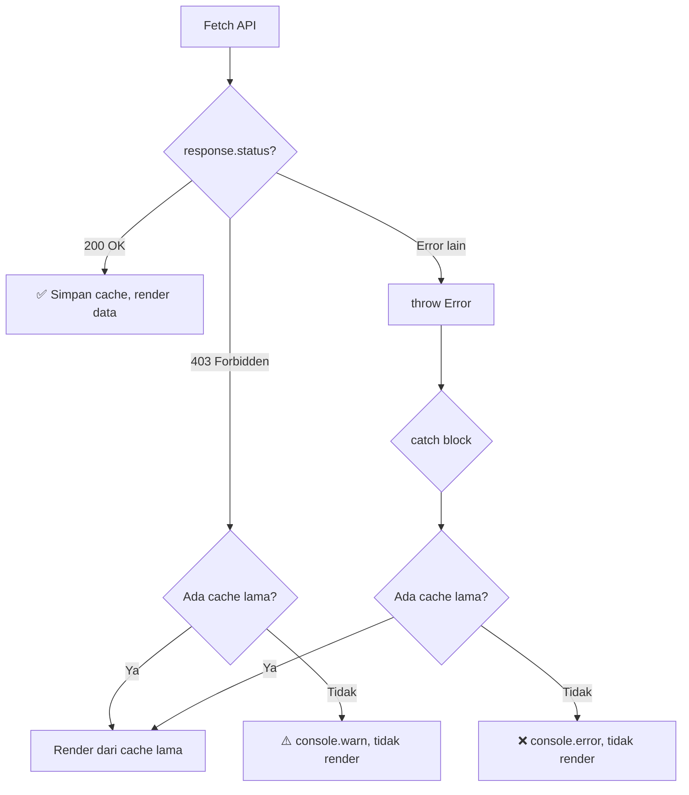
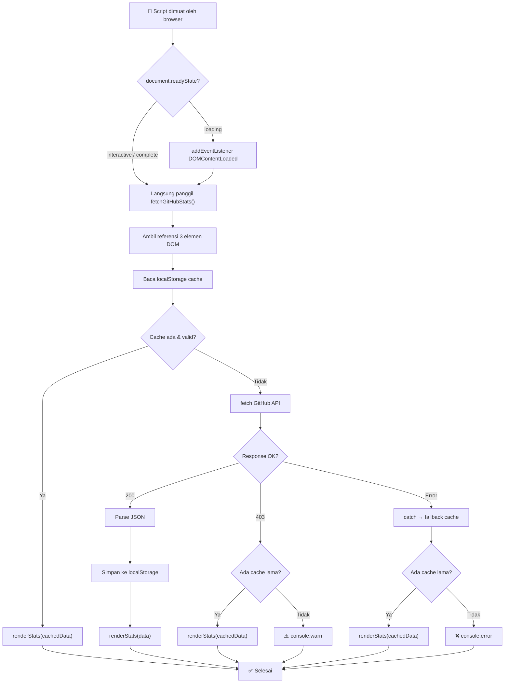

# 📈 Dokumentasi: `github-stats.js`

Dokumentasi lengkap untuk modul **GitHub Profile Stats Fetcher** yang menampilkan jumlah Repositories, Followers, dan Following secara real-time pada portfolio website Adinda Kristiyani.

---

## Daftar Isi

- [Gambaran Umum](#gambaran-umum)
- [Sumber Data (API)](#sumber-data-api)
- [Struktur File](#struktur-file)
- [Konstanta & Konfigurasi](#konstanta--konfigurasi)
- [Fungsi-Fungsi](#fungsi-fungsi)
  - [fetchGitHubStats()](#1-fetchgithubstats)
  - [renderStats()](#2-renderstatsdatainternal)
- [Elemen HTML yang Dibutuhkan](#elemen-html-yang-dibutuhkan)
- [Mekanisme Caching](#mekanisme-caching)
- [Penanganan Rate Limit](#penanganan-rate-limit)
- [Alur Eksekusi](#alur-eksekusi)
- [Data yang Ditampilkan](#data-yang-ditampilkan)
- [Keterbatasan & Catatan](#keterbatasan--catatan)
- [Dependensi](#dependensi)

---

## Gambaran Umum

File `github-stats.js` bertanggung jawab untuk:

1. **Mengambil data profil publik GitHub** melalui GitHub REST API v3 (tanpa token/autentikasi)
2. **Menampilkan 3 statistik utama** — jumlah Repositories, Followers, dan Following
3. **Menyimpan cache** ke `localStorage` selama 1 jam untuk menghindari rate limit
4. **Menangani rate limit (HTTP 403)** secara graceful dengan fallback ke cache

---

## Sumber Data (API)

| Properti          | Detail |
|-------------------|--------|
| **Provider**      | [GitHub REST API v3](https://docs.github.com/en/rest/users/users#get-a-user) |
| **Endpoint**      | `https://api.github.com/users/itskristyy` |
| **Auth**          | Tidak diperlukan (public endpoint) |
| **CORS**          | ✅ Enabled |
| **Rate Limit**    | 60 request/jam per IP (tanpa token) |
| **Method**        | `GET` |

### Format Response API

Response lengkap dari GitHub Users API sangat besar. Berikut field-field yang digunakan oleh script ini:

```json
{
  "login": "itskristyy",
  "id": 123456789,
  "avatar_url": "https://avatars.githubusercontent.com/u/...",
  "name": "Adinda Kristiyani",
  "public_repos": 8,
  "followers": 3,
  "following": 5,
  "created_at": "2024-01-15T00:00:00Z",
  "updated_at": "2026-07-12T10:00:00Z"
}
```

**Field yang digunakan:**

| Field          | Tipe     | Deskripsi |
|----------------|----------|-----------|
| `public_repos` | `number` | Jumlah repository publik |
| `followers`    | `number` | Jumlah akun yang mem-follow user ini |
| `following`    | `number` | Jumlah akun yang di-follow oleh user ini |

> [!NOTE]
> Seluruh field lain dari response (seperti `avatar_url`, `name`, `bio`, dsb.) juga ikut tersimpan di cache, meskipun tidak dirender. Ini memungkinkan pengembangan fitur tambahan tanpa fetch ulang.

---

## Struktur File

```
assets/js/github-stats.js (62 baris)
│
├── Konstanta & Konfigurasi           (baris 1-3)
│   ├── githubUsername
│   ├── CACHE_KEY
│   └── CACHE_DURATION
│
├── Fungsi Utama
│   └── fetchGitHubStats()            (baris 5-56)
│       ├── DOM element lookup         (baris 6-8)
│       ├── Cache check                (baris 10-18)
│       ├── API fetch + error handling (baris 20-49)
│       └── renderStats() [inner]      (baris 51-55)
│
└── Inisialisasi                       (baris 58-62)
```

---

## Konstanta & Konfigurasi

```javascript
const githubUsername = "itskristyy";
const CACHE_KEY = "github_stats_cache";
const CACHE_DURATION = 60 * 60 * 1000; // 1 jam (3.600.000 ms)
```

| Konstanta        | Tipe     | Default                  | Deskripsi |
|------------------|----------|--------------------------|-----------|
| `githubUsername`  | `string` | `"itskristyy"`           | Username GitHub target |
| `CACHE_KEY`      | `string` | `"github_stats_cache"`   | Key localStorage untuk menyimpan cache |
| `CACHE_DURATION` | `number` | `3600000` (1 jam)        | Durasi cache berlaku (dalam milidetik) |

> [!TIP]
> Untuk mengganti user, ubah hanya `githubUsername`. Endpoint API akan otomatis menggunakan username baru.

---

## Fungsi-Fungsi

### 1. `fetchGitHubStats()`

**Async function** — Fungsi utama yang mengatur seluruh alur: cek cache → fetch API → handle error → render ke DOM.

**Parameter:** Tidak ada.

**Return:** `Promise<void>`

**Baris:** 5–56

#### Detail Alur Internal

**Step 1: DOM Element Lookup (baris 6–8)**

```javascript
const reposEl = document.getElementById('github-repos');
const followersEl = document.getElementById('github-followers');
const followingEl = document.getElementById('github-following');
```

Mengambil referensi ke 3 elemen DOM di awal fungsi. Referensi ini digunakan oleh inner function `renderStats()`.

**Step 2: Cache Check (baris 10–18)**

```javascript
const cached = localStorage.getItem(CACHE_KEY);
if (cached) {
  const { data, timestamp } = JSON.parse(cached);
  if (Date.now() - timestamp < CACHE_DURATION) {
    renderStats(data);
    return; // ← Fungsi berhenti di sini jika cache valid
  }
}
```

- Baca cache dari `localStorage`
- Parse JSON untuk mendapatkan `data` dan `timestamp`
- Jika selisih waktu sekarang dengan timestamp cache < 1 jam → gunakan cache, **tidak fetch API**
- Jika cache expired → lanjut ke Step 3

**Step 3: Fetch API (baris 20–49)**

```javascript
const response = await fetch(`https://api.github.com/users/${githubUsername}`);
```

Fetch tanpa header Authorization (public data, tidak perlu token).

**Step 3a: Handle Rate Limit — HTTP 403 (baris 24–32)**

```javascript
if (response.status === 403) {
  if (cached) {
    renderStats(JSON.parse(cached).data);
  } else {
    console.warn("Rate limit exceeded, no cache available.");
  }
  return;
}
```

GitHub mengembalikan `403 Forbidden` saat rate limit tercapai (60 req/jam tanpa token). Script akan:
- Gunakan cache lama jika ada (meski expired)
- Jika tidak ada cache → log warning, tidak render apa-apa

**Step 3b: Handle Error Lain (baris 34)**

```javascript
if (!response.ok) throw new Error(`HTTP error! status: ${response.status}`);
```

Selain 403, semua response non-OK di-throw sebagai error.

**Step 3c: Sukses — Simpan Cache & Render (baris 36–44)**

```javascript
const data = await response.json();
localStorage.setItem(CACHE_KEY, JSON.stringify({
  data,
  timestamp: Date.now()
}));
renderStats(data);
```

**Step 3d: Catch — Fallback ke Cache (baris 45–48)**

```javascript
catch (error) {
  console.error('Error fetching GitHub stats:', error);
  if (cached) renderStats(JSON.parse(cached).data);
}
```

Jika fetch gagal total (network error, timeout, dsb.), gunakan cache lama sebagai fallback.

> [!IMPORTANT]
> Fungsi ini **tidak pernah throw error** ke caller. Semua error ditangkap dan di-log ke console. Worst case: tidak ada data yang dirender (elemen tetap menampilkan spinner loading).

---

### 2. `renderStats(data)` *(internal)*

**Inner function** — Didefinisikan di dalam `fetchGitHubStats()`. Mengupdate teks elemen DOM dengan data statistik.

**Parameter:**

| Param  | Tipe     | Deskripsi |
|--------|----------|-----------|
| `data` | `object` | Object response dari GitHub Users API |

**Return:** `void`

**Baris:** 51–55

```javascript
function renderStats(data) {
  if (reposEl) reposEl.textContent = data.public_repos;
  if (followersEl) followersEl.textContent = data.followers;
  if (followingEl) followingEl.textContent = data.following;
}
```

**Pemetaan data → elemen:**

| Field API        | Elemen Target       | Contoh Output |
|------------------|---------------------|---------------|
| `data.public_repos` | `#github-repos`  | `8`           |
| `data.followers`    | `#github-followers` | `3`        |
| `data.following`    | `#github-following` | `5`        |

> [!NOTE]
> Setiap update dicek dengan `if (el)` untuk mencegah error jika elemen tidak ditemukan di DOM. Ini membuat script aman untuk digunakan di halaman yang tidak memiliki semua 3 elemen.

---

## Elemen HTML yang Dibutuhkan

Script ini mengharapkan elemen-elemen berikut di halaman HTML:

```html
<div class="github-stats__grid">
  <div class="stat-card glass-card">
    <p class="stat-card__value" id="github-repos">
      <i class='bx bx-loader-alt bx-spin'></i>
    </p>
    <p class="stat-card__label">Repositories</p>
  </div>
  <div class="stat-card glass-card">
    <p class="stat-card__value" id="github-followers">
      <i class='bx bx-loader-alt bx-spin'></i>
    </p>
    <p class="stat-card__label">Followers</p>
  </div>
  <div class="stat-card glass-card">
    <p class="stat-card__value" id="github-following">
      <i class='bx bx-loader-alt bx-spin'></i>
    </p>
    <p class="stat-card__label">Following</p>
  </div>
</div>
```

| ID                   | Elemen | Fungsi | Nilai Awal |
|----------------------|--------|--------|------------|
| `#github-repos`      | `<p>`  | Menampilkan jumlah repository publik | Spinner `<i class="bx bx-loader-alt bx-spin">` |
| `#github-followers`  | `<p>`  | Menampilkan jumlah followers | Spinner |
| `#github-following`  | `<p>`  | Menampilkan jumlah following | Spinner |

**Perilaku elemen:**
- **Sebelum data dimuat:** Menampilkan ikon spinner (Boxicons `bx-loader-alt bx-spin`)
- **Setelah data dimuat:** `textContent` di-replace dengan angka, spinner otomatis hilang
- **Jika fetch gagal tanpa cache:** Spinner tetap tampil (tidak ada fallback teks)

> [!WARNING]
> Jika elemen tidak ditemukan di DOM, fungsi `renderStats()` akan skip elemen tersebut secara diam-diam. **Tidak ada error** yang dilempar, tapi data juga tidak ditampilkan.

---

## Mekanisme Caching

### Struktur Data Cache

```
┌──────────────────────────────────────────────┐
│              localStorage                     │
│                                               │
│  Key: "github_stats_cache"                    │
│  Value: {                                     │
│    "data": {                                  │
│      "login": "itskristyy",                  │
│      "public_repos": 8,                      │
│      "followers": 3,                         │
│      "following": 5,                         │
│      ... (semua field dari GitHub API)        │
│    },                                         │
│    "timestamp": 1752328800000                 │
│  }                                            │
└──────────────────────────────────────────────┘
```

### Konfigurasi

| Aspek            | Detail |
|------------------|--------|
| **Storage**      | `localStorage` |
| **Key**          | `"github_stats_cache"` |
| **Durasi**       | 1 jam (3.600.000 ms) |
| **Validasi**     | `Date.now() - timestamp < CACHE_DURATION` |
| **Data cached**  | Seluruh response object dari GitHub API |
| **Clear manual** | `localStorage.removeItem("github_stats_cache")` |

### Tabel Keputusan Cache

| # | Cache ada? | Cache valid? | Fetch berhasil? | HTTP Status | Aksi |
|---|-----------|-------------|-----------------|-------------|------|
| 1 | ✅ | ✅ (< 1 jam) | — (tidak fetch) | — | Render dari cache |
| 2 | ✅ | ❌ (expired) | ✅ | 200 | Fetch → update cache → render |
| 3 | ✅ | ❌ (expired) | ❌ | 403 | Render dari cache lama |
| 4 | ✅ | ❌ (expired) | ❌ | Error lain | Render dari cache lama |
| 5 | ❌ | — | ✅ | 200 | Fetch → simpan cache → render |
| 6 | ❌ | — | ❌ | 403 | Log warning, tidak render |
| 7 | ❌ | — | ❌ | Error lain | Log error, tidak render |

---

## Penanganan Rate Limit

GitHub REST API menerapkan rate limit **60 request per jam per IP** untuk request tanpa autentikasi.

### Bagaimana script menangani ini?



### Kenapa tanpa token?

| Aspek | Dengan Token | Tanpa Token (saat ini) |
|-------|-------------|----------------------|
| Rate limit | 5.000 req/jam | 60 req/jam |
| Keamanan | ⚠️ Token terekspos di client-side JS | ✅ Tidak ada secret yang terekspos |
| Setup | Perlu manage token | Zero config |
| Cocok untuk | High-traffic app | Portfolio pribadi |

> [!CAUTION]
> **Jangan pernah menyimpan GitHub Personal Access Token di file JavaScript client-side.** Token akan terlihat oleh siapa pun yang membuka DevTools. Dengan caching 1 jam, 60 req/jam sudah lebih dari cukup untuk portfolio.

---

## Alur Eksekusi



---

## Data yang Ditampilkan

### Pemetaan Visual

```
┌───────────────────────────────────────────────────────┐
│              GitHub Footprint                          │
│                                                        │
│  ┌──────────┐   ┌──────────┐   ┌──────────┐          │
│  │    8     │   │    3     │   │    5     │          │
│  │  Repos   │   │Followers │   │Following │          │
│  └──────────┘   └──────────┘   └──────────┘          │
│                                                        │
│  ↑ #github-repos  ↑ #github-followers  ↑ #github-following │
└───────────────────────────────────────────────────────┘
```

### Transisi State

| State | `#github-repos` | `#github-followers` | `#github-following` |
|-------|----------------|--------------------|--------------------|
| **Loading** | 🔄 Spinner | 🔄 Spinner | 🔄 Spinner |
| **Loaded** | `8` | `3` | `5` |
| **Error (ada cache)** | Nilai cache lama | Nilai cache lama | Nilai cache lama |
| **Error (tanpa cache)** | 🔄 Spinner (tetap) | 🔄 Spinner (tetap) | 🔄 Spinner (tetap) |

---

## Keterbatasan & Catatan

### Keterbatasan API

| Keterbatasan | Detail |
|-------------|--------|
| **Rate limit** | 60 request/jam per IP tanpa token |
| **Public repos only** | `public_repos` hanya menghitung repo publik |
| **Eventual consistency** | Data mungkin delay beberapa menit dari perubahan sebenarnya |
| **Tidak real-time** | Nilai di-cache 1 jam, perubahan baru terlihat setelah cache expired |

### Keterbatasan Script

| Keterbatasan | Detail |
|-------------|--------|
| **Single user** | Username hardcoded sebagai konstanta |
| **Tidak ada loading skeleton** | Hanya spinner icon sebelum data tersedia |
| **Tidak ada retry** | Jika fetch gagal, tidak ada mekanisme retry otomatis |
| **Tidak ada error UI** | Error hanya di-log ke console, user tidak diberi notifikasi visual |
| **textContent replace** | Spinner loading HTML di-replace sepenuhnya, tidak bisa kembali ke state loading |

### Perbedaan dengan `github-contributions.js`

| Aspek | `github-stats.js` | `github-contributions.js` |
|-------|-------------------|--------------------------|
| **API** | GitHub REST API (resmi) | jogruber.de (komunitas) |
| **Data** | Profil user (repos, followers) | Kontribusi harian (heatmap) |
| **Auth** | Tidak perlu | Tidak perlu |
| **Rate limit** | 60/jam | Tidak didokumentasikan |
| **Cache key** | `github_stats_cache` | `github_contributions_cache` |
| **Theme reactive** | ❌ Tidak | ✅ Ya (MutationObserver) |
| **Render** | Update `textContent` | Build DOM dinamis |

### Tips Pengembangan

> [!TIP]
> - **Menguji tanpa cache:** DevTools → Application → Local Storage → hapus `github_stats_cache`
> - **Menguji rate limit:** Jalankan `for(let i=0;i<61;i++) fetch('https://api.github.com/users/itskristyy')` di console → request ke-61 akan mendapat 403
> - **Melihat sisa rate limit:** Cek response header `X-RateLimit-Remaining` di Network tab DevTools
> - **Menambah data yang ditampilkan:** Tambahkan elemen HTML baru dan update `renderStats()` — response API sudah di-cache sepenuhnya

---

## Dependensi

| Dependensi | Tipe | Detail |
|-----------|------|--------|
| Browser `fetch` API | Built-in | Untuk HTTP request ke GitHub API |
| Browser `localStorage` | Built-in | Untuk menyimpan cache data profil |
| Browser `document.getElementById` | Built-in | Untuk mengakses elemen DOM |
| [Boxicons](https://boxicons.com/) | External CSS | Ikon spinner loading (`bx-loader-alt bx-spin`) |
| Internet connection | External | Diperlukan untuk fetch pertama kali (tanpa cache) |
| `api.github.com` | External API | Sumber data profil GitHub |

> Tidak ada dependensi npm/library JavaScript pihak ketiga. Semua menggunakan vanilla JavaScript.
